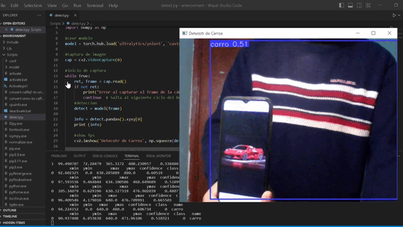

# Proyecto de evaluación

---


---

## Autor: Juan Carlos González Ibarra
## Correo Institucional: juan.gonzalez.dti@imfe.mx

---

## Fecha: 22 de noviembre, 2023

---

## Contenido

1. Introducción
2. Objetivo
3. Desarrolllo de proyecto
  - Etapa 1: Comprensión Teórica de YOLOv5 y Visión Artificial
  - Etapa 2: Preparación del Entorno de Trabajo
  - Etapa 3: Adquisición y Preprocesamiento de Datos
  - Etapa 4: Entrenamiento del Modelo
  - Etapa 5: Implementación en una Aplicación Práctica
4. Conclusión

---
# 1. Introducción

La **Inteligencia Artificial (IA)** es un campo que busca crear sistemas capaces de realizar tareas que normalmente requieren inteligencia humana. Estas tareas incluyen el razonamiento, la percepción, el aprendizaje y la comprensión del lenguaje. Uno de los subcampos más importantes y activos dentro de la IA es el **Machine Learning (ML)**, que se centra en desarrollar algoritmos y modelos estadísticos que permiten a las máquinas mejorar su desempeño en una tarea específica a través de la experiencia y los datos.

El ML es la aplicación de algoritmos que pueden aprender y tomar decisiones basadas en datos para que las computadoras aprendan de estos datos y mejoren con la experiencia sin estar programadas explícitamente.

Una de estos algoritmos y modelos estadísticos son las **redes neuronales artificiales**.

## 쯈ué es una red neuronal?

Una **red neuronal** es un método de la inteligencia artificial que enseña a las computadoras a procesar datos de una manera que está inspirada en la forma en que lo hace el cerebro humano. Se trata de un tipo de proceso de machine learning llamado aprendizaje profundo, que utiliza los nodos o las neuronas interconectados en una estructura de capas que se parece al cerebro humano. Crea un sistema adaptable que las computadoras utilizan para aprender de sus errores y mejorar continuamente. De esta forma, las redes neuronales artificiales intentan resolver problemas complicados, como la realización de resúmenes de documentos o el reconocimiento de rostros, con mayor precisión.

## 쯇or qué son importantes las redes neuronales?

Las redes neuronales pueden ayudar a las computadoras a tomar decisiones inteligentes con asistencia humana limitada. Esto se debe a que pueden aprender y modelar las relaciones entre los datos de entrada y salida que no son lineales y que son complejos. Por ejemplo, pueden realizar las siguientes tareas.

## 쮺칩mo funcionan las redes neuronales?
El cerebro humano es lo que inspira la arquitectura de las redes neuronales. Las células del cerebro humano, llamadas neuronas, forman una red compleja y con un alto nivel de interconexión y se envían señales eléctricas entre sí para ayudar a los humanos a procesar la información. De manera similar, una red neuronal artificial está formada por neuronas artificiales que trabajan juntas para resolver un problema. Las neuronas artificiales son módulos de software, llamados nodos, y las redes neuronales artificiales son programas de software o algoritmos que, en esencia, utilizan sistemas informáticos para resolver cálculos matemáticos.

## Arquitectura de una red neuronal simple
Una red neuronal básica tiene neuronas artificiales interconectadas en tres capas:

- Capa de entrada
  -La información del mundo exterior entra en la red neuronal artificial desde la capa de entrada. Los nodos de entrada procesan los datos, los analizan o los clasifican y los pasan a la siguiente capa.

- Capa oculta
  -Las capas ocultas toman su entrada de la capa de entrada o de otras capas ocultas. Las redes neuronales artificiales pueden tener una gran cantidad de capas ocultas. Cada capa oculta analiza la salida de la capa anterior, la procesa aún más y la pasa a la siguiente capa.

- Capa de salida
  - La capa de salida proporciona el resultado final de todo el procesamiento de datos que realiza la red neuronal artificial. Puede tener uno o varios nodos. Por ejemplo, si tenemos un problema de clasificación binaria (sí/no), la capa de salida tendrá un nodo de salida que dará como resultado 1 o 0. Sin embargo, si tenemos un problema de clasificación multiclase, la capa de salida puede estar formada por más de un nodo de salida.


## 쮺uáles son los tipos de redes neuronales?
Las redes neuronales artificiales pueden clasificarse en función de cómo fluyen los datos desde el nodo de entrada hasta el nodo de salida. A continuación, se indican varios ejemplos:

## Redes neuronales prealimentadas
Las redes neuronales prealimentadas procesan los datos en una dirección, desde el nodo de entrada hasta el nodo de salida. Todos los nodos de una capa están conectados a todos los nodos de la capa siguiente. Una red prealimentada utiliza un proceso de retroalimentación para mejorar las predicciones a lo largo del tiempo.

## Algoritmo de retropropagación
Las redes neuronales artificiales aprenden de forma continua mediante el uso de bucles de retroalimentación correctivos para mejorar su análisis predictivo. En pocas palabras, puede pensar en los datos que fluyen desde el nodo de entrada hasta el nodo de salida a través de muchos caminos diferentes en la red neuronal. Solo un camino es el correcto: el que asigna el nodo de entrada al nodo de salida correcto. 

Para encontrar este camino, la red neuronal utiliza un bucle de retroalimentación que funciona de la siguiente manera:

- Cada nodo intenta adivinar el siguiente nodo de la ruta.
- Se comprueba si la suposición es correcta. 
- Los nodos asignan valores de peso más altos a las rutas que conducen a más suposiciones correctas y valores de peso más bajos a las rutas de los nodos que conducen a suposiciones incorrectas.
- Para el siguiente punto de datos, los nodos realizan una predicción nueva con las trayectorias de mayor peso y luego repiten el paso 1.

## Redes neuronales convolucionales
Las capas ocultas de las **redes neuronales convolucionales** realizan funciones matemáticas específicas, como la síntesis o el filtrado, denominadas convoluciones. Son muy útiles para la clasificación de imágenes porque pueden extraer características relevantes de las imágenes que son útiles para el reconocimiento y la clasificación de imágenes. La forma nueva es más fácil de procesar sin perder características que son fundamentales para hacer una buena predicción. Cada capa oculta extrae y procesa diferentes características de la imagen, como los bordes, el color y la profundidad.

## 쮺칩mo entrenar las redes neuronales?
El entrenamiento de redes neuronales es el proceso de enseñar a una red neuronal a realizar una tarea y una parte crucial del aprendizaje automático. En principio, las redes neuronales aprenden procesando varios conjuntos grandes de datos etiquetados o sin etiquetar y se puede realizar a través de dos enfoques principales: **aprendizaje supervisado** y **aprendizaje no supervisado**. Estos enfoques se diferencian principalmente en el tipo de datos con los que trabajan y cómo se utiliza esa información para entrenar a la red.

## Aprendizaje No Supervisado

Es un tipo de aprendizaje automático en el que no se proporciona una variable objetivo previamente. En cambio, busca patrones y estructuras inherentes en los datos sin etiquetas. El objetivo principal de un aprendizaje no supervisado es encontrar agrupaciones, similitudes o relaciones ocultas en los datos. Este tipo de aprendizaje explora los datos sin ninguna guía específica y pueden revelar información valiosa sobre las características y estructuras subyacentes de los datos. Los aprendizajes no supervisados se utilizan en diversos casos, como la segmentación de clientes, la detección de anomalías, la reducción de dimensionalidad y la recomendación de productos. 

## Aprendizaje Supervisado

En el aprendizaje supervisado se proporcionan a las redes neuronales artificiales conjuntos de datos etiquetados que ofrecen la respuesta correcta por adelantado. La red neuronal aumenta lentamente el conocimiento a partir de estos conjuntos de datos, que proporcionan la respuesta correcta por adelantado. Una vez que se entrena la red, comienza a adivinar el origen étnico o la emoción de una imagen nueva de un rostro humano que nunca antes ha procesado.El aprendizaje supervisado utiliza los valores de uno o varios campos de entrada para predecir el valor de uno o varios resultados o campos de destino.


## 쯇ara qué se utilizan las redes neuronales?

Las redes neuronales están presentes en varios casos de uso en muchos sectores, como:

- Diagnóstico médico mediante la clasificación de imágenes médicas
- Marketing orientado mediante el filtrado de redes sociales y el análisis de datos de comportamiento
- Predicciones financieras mediante el procesamiento de datos históricos de instrumentos financieros
- Previsión de la carga eléctrica y la demanda de energía
- Proceso y control de calidad
- Identificación de compuestos químicos

Una las aplicaciones más importantes de las redes neuronales es la **"Visión Artificial"**.

## Visión artificial

La visión artificial es la capacidad que tienen las computadoras para extraer información y conocimientos de imágenes y videos. Con las redes neuronales, las computadoras pueden distinguir y reconocer imágenes de forma similar a los humanos. La visión artificial tiene varias aplicaciones, como las siguientes:

- Reconocimiento visual en los vehículos autónomos para que puedan reconocer las señales de tráfico y a otros usuarios del camino
- Poderación de contenido para eliminar de forma automática los contenidos inseguros o inapropiados de los archivos de imágenes y videos
- Reconocimiento facial para identificar rostros y reconocer atributos como ojos abiertos, gafas y vello facial
- Etiquetado de imágenes para identificar logotipos de marcas, ropa, equipos de seguridad y otros detalles de la imagen


## 쮺칩mo funciona la visión artificial?

La visión artificial necesita de muchos datos. Ejecuta análisis de datos una y otra vez hasta identificar diferencias y, finalmente, reconocer imágenes.

Por ejemplo, para entrenar a una computadora para que reconozca los neumáticos de los automóviles, es necesario alimentarla con grandes cantidades de imágenes de neumáticos y elementos relacionados con los neumáticos para aprender las diferencias y reconocer un neumático, especialmente uno sin defectos.

Se utilizan dos tecnologías esenciales para lograr esto: un tipo de machine learning llamado deep learning y una **red neuronal convolucional (CNN)**.

ML utiliza modelos algorítmicos que permiten que una computadora se enseñe a sí misma sobre el contexto de los datos visuales. Si se alimentan suficientes datos a través del modelo, la computadora "observará" los datos y se enseñará a diferenciar una imagen de otra. Los algoritmos permiten que la máquina aprenda por sí misma, en lugar de que alguien la programe para reconocer una imagen.

Una CNN ayuda a un modelo de machine learning o deep learning a "ver" al dividir las imágenes en píxeles a los que se les asignan etiquetas o rótulos. Utiliza las etiquetas para realizar convoluciones (una operación matemática en dos funciones para producir una tercera función) y hace predicciones sobre lo que está "viendo".

La red neuronal ejecuta convoluciones y verifica la precisión de sus predicciones en una serie de iteraciones hasta que las predicciones comienzan a hacerse realidad. Luego reconocerá o verá imágenes de una manera similar a los humanos.

Al igual que un humano que distingue una imagen a distancia, una CNN primero discierne los bordes sólidos y las formas simples, luego completa la información mientras ejecuta iteraciones de sus predicciones.

Se utiliza una CNN para comprender imágenes individuales. Una red neuronal recurrente (RNN) se usa de manera similar para aplicaciones de video para ayudar a las computadoras a comprender cómo las imágenes en una serie de cuadros se relacionan entre sí.    


---

# 2. Objetivo del Proyecto

Desarrollar un sistema de visión artificial para la detección de objetos utilizando la red neuronal YOLO (You Only Look Once) versión 5. Este sistema estará diseñado para identificar y localizar objetos específicos (personas, smartphones, carros) en video en tiempo real, demostrando así la capacidad del aprendizaje profundo en tareas de visión por computadora.

## 2.1 Desarrollo del Objetivo

En base al **_Objetivo de Proyecto_** se plantea realizar las siguientes **Etapas del Proyecto de Visión Artificial con YOLOv5**.

## Etapa 1: Comprensión Teórica de YOLOv5 y Visión Artificial
- **Objetivo**: Adquirir un conocimiento sólido sobre los principios de la visión artificial y específicamente sobre la arquitectura y el funcionamiento de YOLOv5.
- **Actividades**: 
  - Estudiar recursos relevantes, artículos académicos y documentación técnica sobre redes neuronales.
  - Enfocarse en YOLOv5 y sus predecesores.

## Etapa 2: Preparación del Entorno de Trabajo
- **Objetivo**: Configurar el entorno de desarrollo y las herramientas necesarias para el proyecto.
- **Actividades**: 
  - Instalar el software necesario (como Python, PyTorch, bibliotecas de visión por computadora YOLO V5).
  - Configurar un entorno de desarrollo (Google Collab).
  - Asegurar el acceso a hardware adecuado (GPU para entrenamiento eficiente).

## Etapa 3: Adquisición y Preprocesamiento de Datos
- **Objetivo**: Recolectar y preparar un conjunto de datos adecuado para entrenar y validar el modelo.
- **Actividades**: 
  - Seleccionar y descargar conjuntos de datos relevantes.
  - Realizar el etiquetado de imágenes si es necesario.
  - Normalizar y, posiblemente, aumentar los datos para mejorar la generalización del modelo.

## Etapa 4: Entrenamiento del Modelo
- **Objetivo**: Entrenar la red YOLOv5 con el conjunto de datos preparado.
- **Actividades**: 
  - Configurar los parámetros de entrenamiento (tasa de aprendizaje, número de épocas).
  - Realizar el entrenamiento del modelo.
  - Monitorizar el progreso para asegurar la convergencia.

## Etapa 5: Implementación en una Aplicación Práctica
- **Objetivo**: Desarrollar una aplicación o interfaz para demostrar la funcionalidad del modelo.
- **Actividades**: 
  - Crear una aplicación (software de escritorio).
  - Utilizar el modelo para detectar objetos en tiempo real.

**Nota**: Cada una de estas etapas es crucial para el éxito del proyecto y proporcionará una experiencia práctica y completa en el desarrollo de sistemas de visión artificial con tecnologías de Machine Learning avanzadas.

--- 

# Etapa 1: Comprensión Teórica de YOLOv5

YOLOv5 🚀 es un sistema del estado del arte, que utiliza una red neuronal convolucional para la detección de objetos en tiempo real, que representa Ultralytics en su investigación de código abierto.


<div align="center">

  <a href="https://ultralytics.com/yolov5" target="_blank">
    </a>
</div>


## Funcionamiento de la Red Neuronal YOLOv5

La red neuronal divide la imagen en regiones, prediciendo cuadros de identificación y probabilidades por cada región; las cajas son ponderadas a partir de las probabilidades predichas. El algoritmo aprende representaciones generalizables de los objetos, permitiendo un bajo error de detección para entradas nuevas, diferentes al conjunto de datos de entrenamiento. El algoritmo base corre a 45 cuadros por segundo (FPS) sin procesamiento de lote en un GPU Titan X; una versión rápida del algoritmo funciona a más de 150 fps. Debido a sus características de procesamiento, el algoritmo es utilizado en aplicaciones de detección de objetos en transmisión de video con retazo de señal menor a 25 milisegundos.


## Arquitectura

El modelo se implementó como una red neuronal convolucional y fue evaluado en el set de datos para detección de PASCAL VOC. Las capas convolucionales iniciales de la red se encargan de la extracción de características de la imagen, mientras que las capas de conexión completa predicen la probabilidad de salida y las coordenadas del objeto. La red tiene 24 capas convolucionales seguidas por 2 capas de conexión completa; esta hace uso de capas de reducción de 1x1 seguidas capas convolucionales de 3x3. El modelo Fast YOLO hace uso de una red neuronal de 9 capas. La salida final del modelo tensor de predicción de 7x7x30.


## Entrenamiento

Para el pre entrenamiento, se hace uso de las primeras 20 capas convolucionales seguidas de una capa promediadora de grupos y una capa de conexión completa; posteriormente se convierte el modelo resultante para la obtención de detección de objetos. Para la implementación de detección de objetos se agregan 4 capas convolucionales y 2 capas de conexión completa con ponderaciones aleatoriamente inicializadas. La última capa de la red predice probabilidades de clases y coordenadas para las cajas de identificación; para este paso se normaliza la altura y ancho de la caja de identificación con respecto a los parámetros de la imagen, de tal manera que sus valores se mantengan entre 0 y 1. En la última capa se usa una función de activación, utilizando un error de suma cuadrada para la optimización de la salida.


## Limitaciones

El algoritmo delimita fuertes restricciones espaciales en los límites de la caja de predicción dado que cada celda predice únicamente dos cajas y una clase; esto limita el número de objetos que se pueden detectar, lo cual hace que el algoritmo se vea limitado en la detección de objetos presentados en grupos.

## Versiones de YOLO

- YOLO (2015)
- YOLO9000 (2016)
- YOLOv2 (2017)
- Fast YOLO (2017)
- YOLOv3 (2018)
- YOLOv4 (Abril de 2020)
- **YOLOv5 (2020)**
- YOLOR (2021)
- YOLOv6 (2022)
- YOLOv7 (2022)
- YOLOv8 (2023)

YOLO, YOLO9000, YOLOv2 y YOLOv3, YOLOv5 y YOLOv8 pertenecen al mismo autor, los académicos de la universidad de Washington, que conformaron la empresa Ultrlytics. Pero YOLO no es una marca registrada, queda la duda sobre la significancia del uso del nombre por otros autores, como en YOLOv4, YOLOR y YOLOv7, desarrollados por académicos de la Taiwanesa Academia Sinica. Por último YOLOv6 fue desarrollado por la empresa china de delivery Meituan para sus propios robots autónomos.

## YOLO V5

YOLOv5 (You Only Look Once, versión 5) es la quinta iteración de la famosa serie de algoritmos de detección de objetos YOLO. Desarrollada por Ultralytics, YOLOv5 representa un avance significativo en la detección de objetos en tiempo real gracias a su precisión y velocidad mejoradas.

## Características Clave de YOLOv5

- **Velocidad y Precisión**: YOLOv5 ofrece una combinación óptima de velocidad y precisión, lo que lo hace adecuado para aplicaciones en tiempo real.
- **Arquitectura Mejorada**: Incorpora mejoras en la arquitectura de la red neuronal para aumentar la eficiencia y la precisión.
- **Implementación Simplificada**: Utiliza PyTorch, facilitando la implementación y el entrenamiento personalizado.
- **Compatibilidad con Diversos Tamaños de Modelo**: Disponible en varios tamaños (YOLOv5s, YOLOv5m, YOLOv5l, YOLOv5x), lo que permite su uso en una variedad de dispositivos, desde sistemas embebidos hasta servidores potentes.

## Funcionamiento de YOLOv5

YOLOv5 procesa una imagen completa en una sola evaluación, lo que le permite detectar objetos en tiempo real. Aquí se detallan los aspectos clave de su funcionamiento:

- **División de la Imagen**: La imagen se divide en una cuadrícula, y para cada celda de la cuadrícula, el modelo predice cuadros delimitadores y probabilidades de clase.
- **Uso de Anchors**: Utiliza anchors o anclas (cuadros delimitadores predefinidos) para mejorar la precisión en la detección de objetos.
- **Post-procesamiento**: Aplica técnicas como la supresión de no máximos para refinar las cajas de detección.


## Entrenamiento de YOLOv5

- **Preparación de Datos**: Requiere un conjunto de datos etiquetados con cuadros delimitadores y clases de objetos.
- **Transfer Learning**: Permite utilizar modelos preentrenados para acelerar el entrenamiento y mejorar la precisión en conjuntos de datos específicos.
- **Optimización de Hiperparámetros**: Permite ajustar hiperparámetros como la tasa de aprendizaje y el tamaño del lote para adaptarse a diferentes necesidades.

## Aplicaciones de YOLOv5

- **Vigilancia por Video**: Detección de personas, vehículos y otros objetos en tiempo real.
- **Automoción**: Detección de peatones y obstáculos en sistemas de conducción autónoma.
- **Análisis de Medios Sociales**: Reconocimiento automático de objetos en imágenes y videos.
- **Salud**: Análisis de imágenes médicas para identificación de patologías.

## Limitaciones y Desafíos

- **Detección en Grupos**: Dificultades en la detección de objetos pequeños o cuando están agrupados.
- **Generalización**: Puede requerir un ajuste fino para conjuntos de datos muy específicos o poco comunes.
- **Requisitos de Recursos**: Los modelos más grandes necesitan hardware potente, especialmente para entrenamiento.

## Versiones de YOLOv5

- YOLOv5s: La versión más pequeña y rápida, adecuada para dispositivos con recursos limitados.
- YOLOv5m: Versión de tamaño medio, equilibrio entre velocidad y precisión.
- YOLOv5l: Versión grande, mayor precisión a costa de velocidad.
- YOLOv5x: La versión más grande y precisa, ideal para aplicaciones donde la precisión es crítica.

En resumen, YOLOv5 es una herramienta poderosa en el campo de la detección de objetos, ofreciendo un rendimiento excepcional que lo hace adecuado para una amplia gama de aplicaciones prácticas.


Mas informacion: [Drone-Computer Communication Based Tomato Generative Organ Counting Model Using YOLO V5 and Deep-Sort](https://www.researchgate.net/publication/362894109_Drone-Computer_Communication_Based_Tomato_Generative_Organ_Counting_Model_Using_YOLO_V5_and_Deep-Sort?_tp=eyJjb250ZXh0Ijp7ImZpcnN0UGFnZSI6Il9kaXJlY3QiLCJwYWdlIjoiX2RpcmVjdCJ9fQ)

--- 

---

## Etapa 2: Preparación del Entorno de Trabajo

En esta etapa, se preparará el entorno de trabajo utilizando Google Colab y configurando el archivo `coco128.yaml`, necesario para nuestro proyecto de detección de objetos con YOLOv5.

### Uso de Google Colab

Google Colab es un servicio gratuito basado en la nube que permite ejecutar notebooks de Jupyter sin necesidad de configuración local y con acceso a GPUs gratuitas. 

#### Pasos para Configurar Google Colab:

1. **Accesa a Google Colab desde el repositorio de  YoloV5 a **: 

   - Iniciar sesión con una cuenta de Google.
    
    <p></p>
    
   - Acceder a [Yolo V5](https://github.com/ultralytics/yolov5).
    
    <p></p>
    
   - Seleccionar el apartado el apartado de entrenamiento [Train Custom Data](https://docs.ultralytics.com/yolov5/tutorials/train_custom_data)
   
   <p></p>
   
  
2. **Creación de un Nuevo Notebook**: 
   - Ir a la seccion `Environments` > `Notebooks`.
   
   <p></p>
   
   - Se abrirá un nuevo notebook en el navegador.
   
   <p></p>

3. **Habilitar la GPU**:
   - Ir a `Edit` > `Configuración del Notebook`.
   - Seleccionar `GPU` en el acelerador de hardware.
    
    <p></p>

---

--- 

4. **Instalar las librerias**:
   - Ejecutar el bloque de codigo para:
       - Clonar el repositorio de YOLO V5.
       - Instalar las librerias de torch y utils. 
    
   <p></p>


Clone GitHub [repository](https://github.com/ultralytics/yolov5), install [dependencies](https://github.com/ultralytics/yolov5/blob/master/requirements.txt) and check PyTorch and GPU.

---

```python
!git clone https://github.com/ultralytics/yolov5  # clone
%cd yolov5
%pip install -qr requirements.txt comet_ml  # install

import torch
import utils
display = utils.notebook_init()  # checks
```

--- 
5. **Configurar `coco128.yaml`**:
   - Se tiene clonado el repositorio de YOLO v5:       
    
   <p></p>

6. **Acceder al Directorio de YOLOv5**:
   - Explorar el Archivo `coco128.yaml`:
   - El archivo se encuentra en el directorio `/data` dentro del repositorio.
   
   <p></p>

7. **Modificar el Archivo `coco128.yaml`** (si es necesario):
   - Abrir el archivo en el editor de texto.
   
   <p></p>
   - Realizar cambios necesarios, como ajustar las rutas de los datos de netrenamiento 
   - Modificar las clases de los datos que se van a etiquetar.
   
   ```yaml
   train: /content/data/images/train  # ruta de imagenes de entrenamiento
   val: /content/data/images/val  # ruta de imagenes de validacion
   test:  # test images (optional)
   
   # Classes
   names:
       0: person
       1: cell phone
   
   # Download script/URL (optional)
   download: https://ultralytics.com/assets/coco128.zip
   ```
   <p></p>
   <p></p>
   <p></p>
   
   <p></p>
   

8. **Guardar Cambios**:
   - Guardar el archivo con el nombre **custom.yaml** y cerrar el archivo después de hacer los cambios.
   <p></p>
   
   <p></p>
   

Con estos pasos, se establece un entorno de trabajo en Google Colab con acceso a recursos de computación potentes y se configura el archivo `coco128.yaml`, fundamental para el entrenamiento inicial con YOLOv5.

--- 

---
## Etapa 3: Adquisición y Etiquetado de Imagenes

Recolectar y etiquetar un conjunto de imagenes para entrenar y validar el modelo.


### Recolectar Imagenes


1. **Recolectar imagenes de internet**: 

    - Seleccionar y descargar conjuntos de imagenes
        - Personas
            <p></p>    
            
            <p></p>
        - Smart Phone
            <p></p>    
            
            <p></p>
            <p></p>
            <p></p>
**Nota**: 
- El conjunto de imagenes para entrenamiento en una ruta llamada **_/data/images/train_**.
- El conjunto de imagenes para validacion en una ruta llamada **_/data/images/val_** 
<p></p>
<p></p>

### Etiquetar Imagenes

2. **Etiquetar imagenes**: 

    - Realizar el etiquetado de imágenes para entrenamiento y validacion desde [Makesense](https://www.makesense.ai/).
        - Ingresar
            <p></p>    
            
            <p></p>            
        - Cargar Imagenes (Entrenamiento)
            <p></p>    
            
            <p></p>  
        - Cargar Imagenes (Validacion)
            <p></p>    
            
            <p></p>
 
         - Seleccionar la opcion **_Object detection_** 
            <p></p>    
            
            <p></p> 
         - Crear etiquetas (0: person, 1: cell phone)  
            <p></p>    
            
            <p></p>      
          - Etiquetar Imagenes (Entrenamiento)  
            <p></p>    
            
            <p></p>      
        - Etiquetar Imagenes (Validacion)  
            <p></p>    
            
            <p></p>
3. **Descargar etiquetas**: 
     - Exportar Annotations
     <p></p>
     
     <p></p>
     - Seleccionar en formato YOLO
     <p></p>
     
     <p></p>
     
3. **Guardar etiquetas**: 
     
     <p></p>
     
     <p></p>
     
     
**Nota**: 
- El conjunto de etiquetas para entrenamiento en una ruta llamada **_/data/labels/train_**.
- El conjunto de imagenes para validacion en una ruta llamada **_/data/labels/val_** 
<p></p>
<p></p>

3. **Comprimir data set de entrenamiento en un archivo llamado data.zip y subir a el notebook en Google collab**: 
     
     <p></p>
     
     <p></p>
     
4. **Descomprimir el data con el siguiente comando**:
<p></p>
   
```bash
!unzip -q /content/data.zip -d /content/f saludo():
```
<p></p>
<p></p>
     
<p></p>

---

--- 

## Etapa 4: Entrenamiento del Modelo
Entrenar la red YOLOv5 con el conjunto de datos preparado.

<p align=""><a href="https://bit.ly/ultralytics_hub"></a></p>
<br><br>

### Parametros de entrenamiento


1. **Configurar los parámetros de entrenamiento (tasa de aprendizaje, número de épocas).**: 

    - Realizar el entrenamiento del modelo con el siguiente comando:
     <p></p>    
            
      <p></p>
    
```python
!python train.py --img 640 --batch 4 --epochs 50 --data /content/yolov5/data/custom.yaml --weights yolov5x.pt --cache
```
2. **Describir los parámetros de entrenamiento**: 

    - !python train.py: Este comando ejecuta el script train.py usando Python. El símbolo ! es específico de los cuadernos Jupyter (como Google Colab), y se usa para ejecutar comandos del shell.

    - --img 640: Define el tamaño de la imagen de entrada para el modelo. En este caso, las imágenes serán redimensionadas a 640x640 píxeles. YOLOv5 utiliza imágenes cuadradas, por lo que se proporciona un único número.

    - --batch 4: Establece el tamaño del lote (batch size) en 4. Esto significa que el modelo procesará 4 imágenes a la vez durante el entrenamiento. El tamaño del lote es un parámetro importante que puede afectar la memoria requerida y la velocidad de entrenamiento.

    - --epochs 50: Especifica el número de épocas de entrenamiento. Una época representa una iteración completa sobre todo el conjunto de datos de entrenamiento. Aquí se configura para entrenar el modelo durante 50 épocas.

    - --data /content/yolov5/data/custom.yaml: Indica el archivo YAML que contiene la configuración del conjunto de datos. Este archivo define rutas a los conjuntos de datos de entrenamiento y validación, así como las clases de objetos a detectar. El archivo custom.yaml se encuentra en la ruta /content/yolov5/data/, lo que sugiere que se está utilizando un conjunto de datos personalizado en lugar del COCO128 estándar.

    - --weights yolov5x.pt: Selecciona los pesos iniciales para el entrenamiento. En este caso, se está utilizando yolov5x.pt, que corresponde a la variante "x" (extra large) de YOLOv5. Esto sugiere que el entrenamiento comienza con un modelo preentrenado en otro conjunto de datos (posiblemente más grande o más complejo) y se adapta al conjunto de datos actual.

    - --cache: Este argumento indica que se deben almacenar en caché las imágenes durante el primer época de entrenamiento. Esto puede acelerar las subsiguientes épocas, ya que las imágenes no necesitan ser recargadas desde el disco.

---
3. Monitorizar el progreso para asegurar la convergencia.  
    
    - Entrenamiento
        <p></p>    
            
            <p></p>
            <p></p>    
            
            <p></p>
            <p></p>    
            
            <p></p>
            <p></p>    
            
            <p></p>
            <p></p>    
            
            <p></p>
            <p></p>    
            
            <p></p>
             <p></p>    
            
            <p></p>
     - Pesos
     <p></p>
     
     <p></p>
     
     - Resultados
     <p></p>
     <p style="font-size:smaller;">COMET INFO: ---------------------------------------------------------------------------------------
COMET INFO: Comet.ml OfflineExperiment Summary
COMET INFO: ---------------------------------------------------------------------------------------
COMET INFO:   Data:
COMET INFO:     display_summary_level : 1
COMET INFO:     url                   : [OfflineExperiment will get URL after upload]
COMET INFO:   Metrics [count] (min, max):
COMET INFO:     loss [55]                  : (0.11667758971452713, 0.42063409090042114)
COMET INFO:     metrics/mAP_0.5 [100]      : (0.0016915127519639178, 0.9827929171016223)
COMET INFO:     metrics/mAP_0.5:0.95 [100] : (0.00043652917895707356, 0.7108574717473164)
COMET INFO:     metrics/precision [100]    : (0.001934156378600823, 0.9754909936214834)
COMET INFO:     metrics/recall [100]       : (0.2716049382716049, 0.9876543209876543)
COMET INFO:     train/box_loss [100]       : (0.018203798681497574, 0.0729246437549591)
COMET INFO:     train/cls_loss             : 0.0
COMET INFO:     train/obj_loss [100]       : (0.013444976881146431, 0.029156703501939774)
COMET INFO:     val/box_loss [100]         : (0.007413851097226143, 0.0339466892182827)
COMET INFO:     val/cls_loss               : 0.0
COMET INFO:     val/obj_loss [100]         : (0.003477632999420166, 0.014706958085298538)
COMET INFO:     x/lr0 [100]                : (0.0004960000000000005, 0.0901)
COMET INFO:     x/lr1 [100]                : (0.0004960000000000005, 0.008416)
COMET INFO:     x/lr2 [100]                : (0.0004960000000000005, 0.008416)
COMET INFO:   Others:
COMET INFO:     Name                        : exp
COMET INFO:     comet_log_batch_metrics     : False
COMET INFO:     comet_log_confusion_matrix  : True
COMET INFO:     comet_log_per_class_metrics : False
COMET INFO:     comet_max_image_uploads     : 100
COMET INFO:     comet_mode                  : online
COMET INFO:     comet_model_name            : yolov5
COMET INFO:     hasNestedParams             : True
COMET INFO:     offline_experiment          : True
COMET INFO:   Parameters:
COMET INFO:     anchor_t            : 4.0
COMET INFO:     artifact_alias      : latest
COMET INFO:     batch_size          : 4
COMET INFO:     bbox_interval       : -1
COMET INFO:     box                 : 0.05
COMET INFO:     bucket              : 
COMET INFO:     cfg                 : 
COMET INFO:     cls                 : 0.006250000000000001
COMET INFO:     cls_pw              : 1.0
COMET INFO:     copy_paste          : 0.0
COMET INFO:     cos_lr              : False
COMET INFO:     degrees             : 0.0
COMET INFO:     device              : 
COMET INFO:     entity              : None
COMET INFO:     evolve              : None
COMET INFO:     exist_ok            : False
COMET INFO:     fl_gamma            : 0.0
COMET INFO:     fliplr              : 0.5
COMET INFO:     flipud              : 0.0
COMET INFO:     freeze              : [0]
COMET INFO:     hsv_h               : 0.015
COMET INFO:     hsv_s               : 0.7
COMET INFO:     hsv_v               : 0.4
COMET INFO:     hyp|anchor_t        : 4.0
COMET INFO:     hyp|box             : 0.05
COMET INFO:     hyp|cls             : 0.5
COMET INFO:     hyp|cls_pw          : 1.0
COMET INFO:     hyp|copy_paste      : 0.0
COMET INFO:     hyp|degrees         : 0.0
COMET INFO:     hyp|fl_gamma        : 0.0
COMET INFO:     hyp|fliplr          : 0.5
COMET INFO:     hyp|flipud          : 0.0
COMET INFO:     hyp|hsv_h           : 0.015
COMET INFO:     hyp|hsv_s           : 0.7
COMET INFO:     hyp|hsv_v           : 0.4
COMET INFO:     hyp|iou_t           : 0.2
COMET INFO:     hyp|lr0             : 0.01
COMET INFO:     hyp|lrf             : 0.01
COMET INFO:     hyp|mixup           : 0.0
COMET INFO:     hyp|momentum        : 0.937
COMET INFO:     hyp|mosaic          : 1.0
COMET INFO:     hyp|obj             : 1.0
COMET INFO:     hyp|obj_pw          : 1.0
COMET INFO:     hyp|perspective     : 0.0
COMET INFO:     hyp|scale           : 0.5
COMET INFO:     hyp|shear           : 0.0
COMET INFO:     hyp|translate       : 0.1
COMET INFO:     hyp|warmup_bias_lr  : 0.1
COMET INFO:     hyp|warmup_epochs   : 3.0
COMET INFO:     hyp|warmup_momentum : 0.8
COMET INFO:     hyp|weight_decay    : 0.0005
COMET INFO:     image_weights       : False
COMET INFO:     imgsz               : 640
COMET INFO:     iou_t               : 0.2
COMET INFO:     label_smoothing     : 0.0
COMET INFO:     local_rank          : -1
COMET INFO:     lr0                 : 0.01
COMET INFO:     lrf                 : 0.01
COMET INFO:     mixup               : 0.0
COMET INFO:     momentum            : 0.937
COMET INFO:     mosaic              : 1.0
COMET INFO:     multi_scale         : False
COMET INFO:     name                : exp
COMET INFO:     noautoanchor        : False
COMET INFO:     noplots             : False
COMET INFO:     nosave              : False
COMET INFO:     noval               : False
COMET INFO:     obj                 : 1.0
COMET INFO:     obj_pw              : 1.0
COMET INFO:     optimizer           : SGD
COMET INFO:     patience            : 100
COMET INFO:     perspective         : 0.0
COMET INFO:     project             : runs/train
COMET INFO:     quad                : False
COMET INFO:     rect                : False
COMET INFO:     resume              : False
COMET INFO:     save_dir            : runs/train/exp
COMET INFO:     save_period         : -1
COMET INFO:     scale               : 0.5
COMET INFO:     seed                : 0
COMET INFO:     shear               : 0.0
COMET INFO:     single_cls          : False
COMET INFO:     sync_bn             : False
COMET INFO:     translate           : 0.1
COMET INFO:     upload_dataset      : False
COMET INFO:     val_conf_threshold  : 0.001
COMET INFO:     val_iou_threshold   : 0.6
COMET INFO:     warmup_bias_lr      : 0.1
COMET INFO:     warmup_epochs       : 3.0
COMET INFO:     warmup_momentum     : 0.8
COMET INFO:     weight_decay        : 0.0005
COMET INFO:     workers             : 8
COMET INFO:   Uploads:
COMET INFO:     asset               : 13 (1.03 MB)
COMET INFO:     confusion-matrix    : 1
COMET INFO:     environment details : 1
COMET INFO:     git metadata        : 1
COMET INFO:     images              : 6
COMET INFO:     installed packages  : 1
COMET INFO:     model graph         : 1
COMET INFO:     os packages         : 1
COMET INFO: 
COMET INFO: Still saving offline stats to messages file before program termination (may take up to 120 seconds)
COMET INFO: Starting saving the offline archive
COMET INFO: To upload this offline experiment, run:
    comet upload /content/yolov5/.cometml-runs/e2d1e2a7ae8e4dbb91f1a666802d5448.zip</p>

     <p></p>
**Nota**: Se utiliza los pesos que indica como mejor ubicado en la ruta "**_runs/train/exp/weights/best.pt_**".

---
---
4. **Visualizar los parámetros de entrenamiento**: 

    - Visualizar las graficas de rendimiento y reconocimiento de entrenamiento con el siguiente comando:
     <p></p>    
            
      <p></p>
    
```bash
%load_ext tensorboard
%tensorboard   --logdir runs
```
---

---
4. **Descargar el mejor peso entrenado**: 

    - Descargar el archivo "**_best.pt_**":
     <p></p>    
            
      <p></p>
    
```bash
from google.colab import files
files.download('./runs/train/exp/weights/best.pt')
```
---

--- 
## Etapa 5: Implementación en una Aplicación Práctica

Desarrollar una aplicación o interfaz para demostrar la funcionalidad del modelo.
  


1. **Configuración del Entorno**:
    - Requisitos: 
        - Instalar [Python == 3.9](https://www.python.org/downloads/release/python-3917/).
        - Instalar PyTorch >= 1.8
       ```bash
       pip install torch==1.8
       ```          

2. **Crear un Entorno Virtual de Python**:
   ```bash
   python -m venv detection
   ```  
   <p></p>    
            
   <p></p>
      
   
3. **Activar el Entorno Virtual**:  
   ```bash
   activate
   ```  
   <p></p>    
            
   <p></p>
      
2. **Instalar los requerimientos de  Pytorch**: 
    
    ```bash 
     pip install -r https://raw.githubusercontent.com/ultralytics/yolov5/master/requirements.txt
     ```
     
    - Requisitos: 
        - Instalar [Requerimientos Pytorch](https://docs.ultralytics.com/yolov5/tutorials/pytorch_hub_model_loading/).
     <p></p>    
       
     <p></p>
     <p></p>
     
     <p></p>
     
3. **Posible error**: 
    
    - Es posible da un error en las librerías por lo que se sugiere instalar
    
    ```bash 
    pip install daal==2021.4.0
     ```
4. **Crear script para deteccion de objetos**:      

    - El script detect.py cargará un modelo entrenado de YOLOv5 y activará la cámara para la detección de objetos.

    - Código Fuente de detect.py
    
     
   ```python
    # Importación de librerías necesarias
    import torch  # Importa PyTorch, utilizado para operaciones de redes neuronales
    import cv2  # Importa OpenCV para manipulación y procesamiento de imágenes
    import numpy as np  # Importa NumPy para manejo de arrays y matrices

    # Cargar el modelo de YOLOv5
    # torch.hub.load carga un modelo de YOLOv5 desde la URL de Ultralytics.
    # Se especifica el modelo 'custom' y la ruta del archivo del modelo preentrenado.
    model = torch.hub.load('ultralytics/yolov5', 'custom', path='D:/YOLO/Proyecto_Final/environment/Scripts/model/model2.pt')

    # Iniciar la captura de vídeo desde la cámara web
    # cv2.VideoCapture(0) inicia la cámara web por defecto en el sistema.
    cap = cv2.VideoCapture(0)

    # Bucle para la captura y detección continua
    while True:
        # cap.read() captura un frame de la cámara web.
        # 'ret' es un booleano que indica si el frame se capturó correctamente.
        # 'frame' es el frame capturado.
        ret, frame = cap.read()

        # Si no se captura el frame correctamente, muestra un mensaje de error y continúa
        if not ret:
            print("Error al capturar el frame de la cámara")
            continue

        # Realizar detección en el frame capturado
        # El modelo procesa el frame y devuelve las detecciones.
        detect = model(frame)

        # Obtener y mostrar información de la detección
        # detect.pandas().xyxy[0] convierte los resultados en un DataFrame de Pandas.
        info = detect.pandas().xyxy[0]
        print(info)

        # Mostrar el frame con las detecciones
        # cv2.imshow muestra la ventana con el frame.
        # np.squeeze elimina dimensiones unitarias del array.
        # detect.render() devuelve el frame con las detecciones dibujadas.
        cv2.imshow('Detector de Carros', np.squeeze(detect.render()))

        # Esperar a que se presione una tecla para interrumpir
        # cv2.waitKey(5) espera 5 milisegundos.
        # Si se presiona la tecla 'Esc' (código ASCII 27), el bucle se rompe.
        t = cv2.waitKey(5)
        if t == 27:
            break

    # Liberar la cámara y cerrar todas las ventanas
    # cap.release() libera el recurso de la cámara.
    # cv2.destroyAllWindows() cierra todas las ventanas abiertas por OpenCV.
    cap.release()
    cv2.destroyAllWindows()
    ```

    4. **Ejecutar Script**:
    ```bash 
    python detect.py
     ```
<p></p>
    
<p></p>
<p></p>
    
<p></p>


5. **Deteccion de Objetos**:
<p></p>
    
<p></p>
<p></p>
    
<p></p>
<p></p>
    
<p></p>

6. **Errores de Detección en Carro**:
<p></p>
    
<p></p>
<p></p>


---

---

# 4. Conclusión

A lo largo de este proyecto, se implementó YOLOv5 para la detección de objetos, centrando el análisis en dos modelos distintos: uno para la detección de personas y smartphones, y otro para vehículos. Este enfoque permitió evaluar la versatilidad y eficacia de YOLOv5 en diferentes contextos y tipos de objetos.

Se observó que YOLOv5, con su arquitectura optimizada y capacidad para procesar imágenes en tiempo real, es altamente efectivo en la identificación y localización precisa de objetos específicos dentro de un entorno dinámico. El modelo mostró una notable precisión en la detección de personas y smartphones, lo cual es crucial en aplicaciones como la vigilancia de seguridad y el análisis de comportamiento del consumidor. Por otro lado, la detección de vehículos tuvo errores en la deteccion posiblemente a la poca cantidad de imagenes y/o un entrenamiento mayor para obtener los pesos ideales para la deteccion.

El proyecto también destacó la importancia de un preprocesamiento adecuado de los datos y la selección de un conjunto de entrenamiento representativo. Se hizo evidente que el rendimiento del modelo puede mejorarse significativamente mediante la optimización de parámetros y el entrenamiento con datos diversificados.

En conclusión, YOLOv5 se presenta como una herramienta poderosa y flexible para la detección de objetos en múltiples dominios. Sin embargo, es fundamental continuar con la experimentación y el ajuste fino para adaptar los modelos a necesidades específicas y mejorar aún más su precisión y eficiencia.

---

# 5. Bibliografía

- Jocher, Glenn, et al. "YOLOv5 Documentation." [YOLOv5](https://docs.ultralytics.com/yolov5/), Ultralytics, 2020.
- Redmon, Joseph, et al. "YOLOv3: An Incremental Improvement." [arXiv:1804.02767](https://arxiv.org/abs/1804.02767), 2018.
- Bochkovskiy, Alexey, et al. "YOLOv4: Optimal Speed and Accuracy of Object Detection." [arXiv:2004.10934](https://arxiv.org/abs/2004.10934), 2020.
- "PyTorch Documentation." [PyTorch](https://pytorch.org/docs/stable/index.html), PyTorch.
- Rosebrock, Adrian. "YOLO Object Detection with OpenCV." [PyImageSearch](https://www.pyimagesearch.com/2018/11/12/yolo-object-detection-with-opencv/), 2018.
- Howard, Andrew, et al. "MobileNets: Efficient Convolutional Neural Networks for Mobile Vision Applications." [arXiv:1704.04861](https://arxiv.org/abs/1704.04861), 2017.
- "Computer Vision - Object Detection with Deep Learning." [Coursera](https://www.coursera.org/learn/deep-learning-object-detection), Coursera.
- "Deep Learning for Computer Vision." [Udacity](https://www.udacity.com/course/deep-learning-nanodegree--nd101), Udacity.

---


